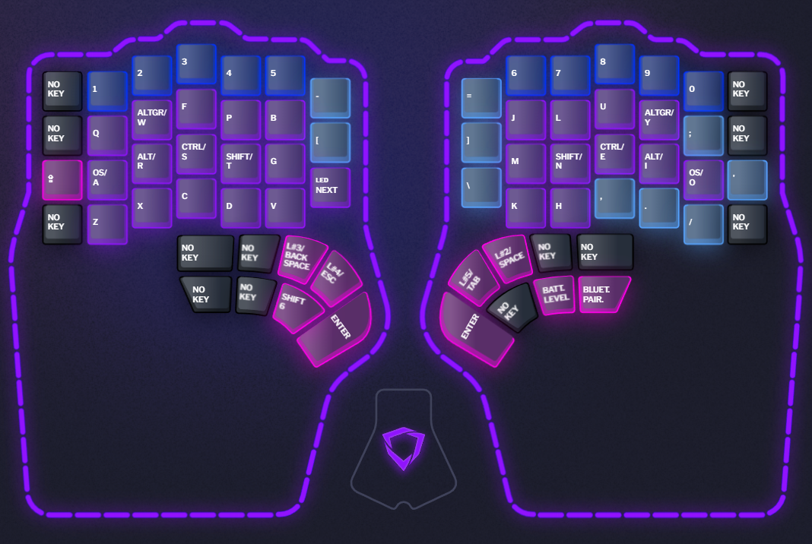
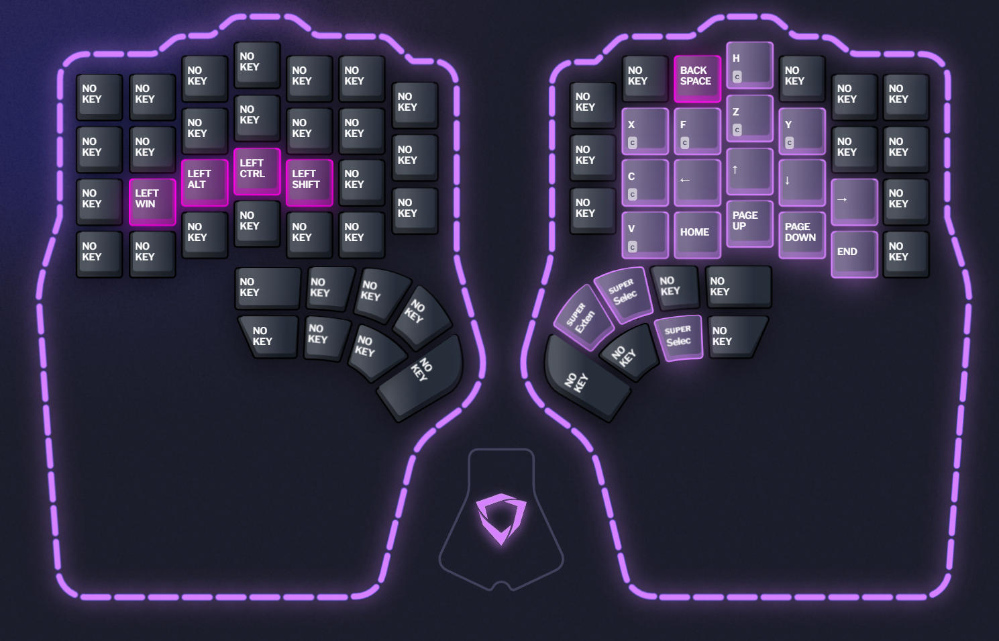
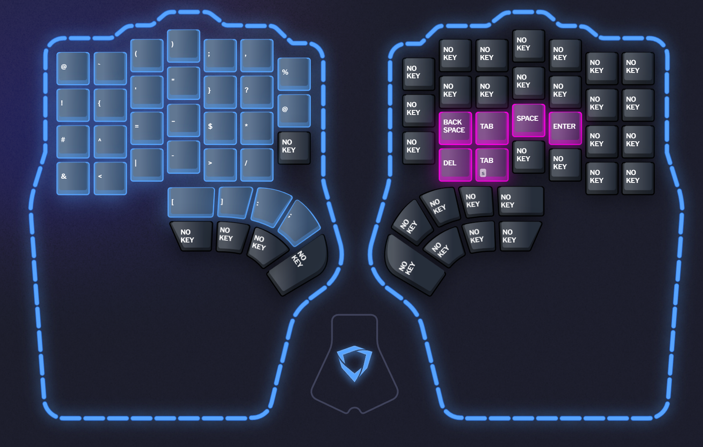
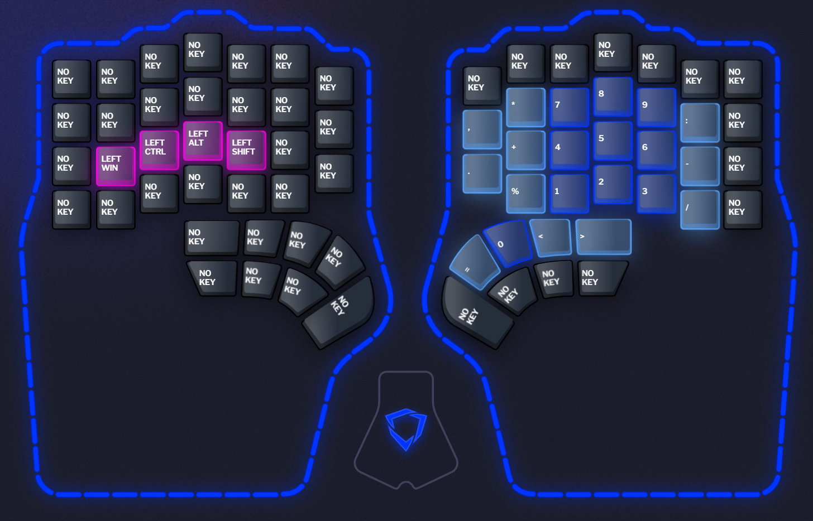

# Dygma Defy keyboard layout

## Layers
Color legend:
* purple: letters
* dark blue: numbers
* light blue: symbols
* dark pink: modifiers
* light pink: navigation
* black: no key

### Base layer

### Navigation layer

### Symbols layer

### Numbers layer

