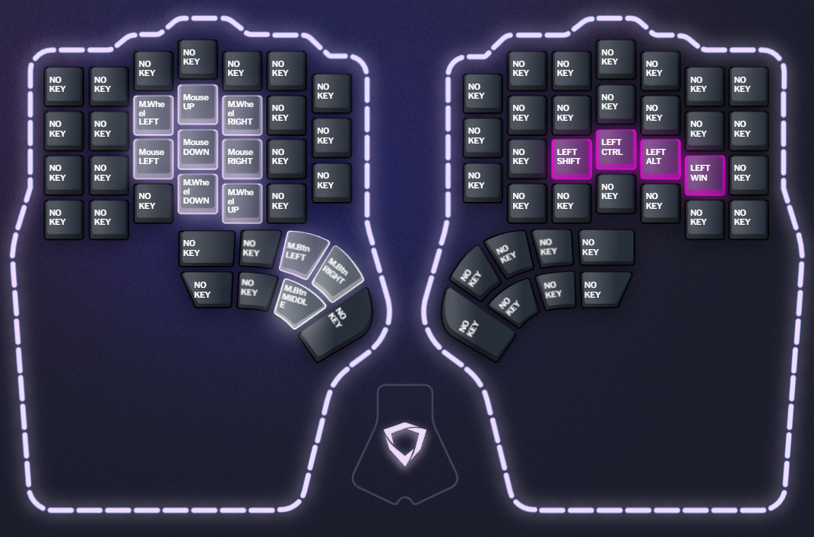

# Dygma Defy keyboard layout

Heavily based on [sunaku's Glove80 layout](https://sunaku.github.io/moergo-glove80-keyboard.html#layers) but with fewer layers.

## Layers

Color legend:

* purple: letters
* dark blue: numbers
* light blue: symbols
* dark pink: modifiers
* light pink: navigation
* white: mouse keys
* black: no key

### Base

* [Colemak-DH](https://colemakmods.github.io/mod-dh/) layout
* Uses [home row mods](https://precondition.github.io/home-row-mods) in [GACS order](https://precondition.github.io/home-row-mods#gacs) on both halves
* Layer shifts (stay in layer as long as you're holding the key):
  + Left thumb home key: navigation layer
  + Right thumb home key: symbols layer
  + Left thumb, one outside of home key: numbers layer
  + Right thumb, one outside of home key: mouse layer

> TODO: update base layer image because it is _wrong_

### Navigation

* Arrow keys on the home row
* Bigger navigation below the home row
* Cut/copy/paste on the inner column

### Symbols

### Numbers

### Mouse

Mouse direction layout is notably different than the arrow key layout in the navigation layer. Might be weird.
